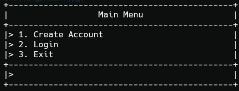
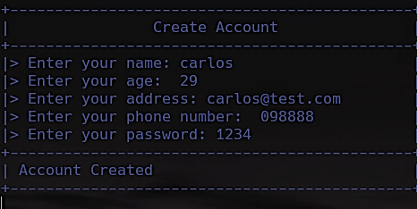
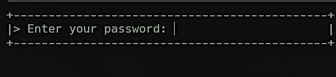
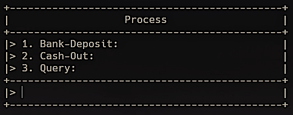
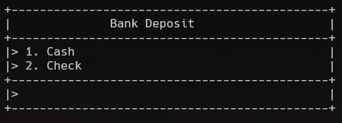
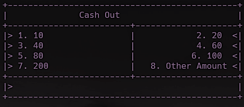
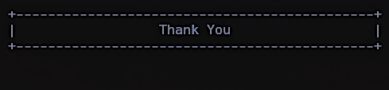

# Simulation for ATM using cpp languages 🏧

Personal project initial code programing languages 

This project was carried out as an assignment for the programming subject in order to learn how to handle different types of validations and the use of loops that serve to maintain control of programs that require this type of reasoning, taking into account a user experience that helps users stay alert to the data entered into the program.

In this section, the standard outputs that the program can have will be shown for its simple and educational use. No graphical interface libraries are used to keep the program usage simple.

### Main Menu
The main menu is given with the basic options of creating an account, logging into an account, and exiting the process.

### First Option

In the first option of creating an account, various data is requested to be able to create a bank account, such as: name, age, email, phone number, and password.

---

### Second Option

The first thing that is displayed when entering the second option is the request for the password, which in this case corresponds to 1234.

#### Sub-Menu
In the submenu of the login section, three new options are provided, which are deposit, withdrawal, and query.

##### Bank Deposti

In the submenu of the login section, three new options are provided, which are deposit, withdrawal, and inquiry.

##### Cash out 

In the withdrawal option, a submenu is displayed showing standard withdrawal amounts, and an option is provided that allows withdrawing another value, which is limited by certain parameters.

---
### Thir Option
In the third option, the program automatically explains itself after the user presses a key.

